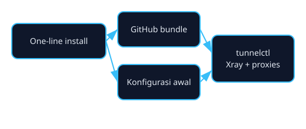

# Cers-Tunneling

Instalasi sekali perintah untuk men-setup layanan tunneling (Xray, SSH/WebSocket, HAProxy, Nginx) dengan kontrol izin admin terpusat.



## Fitur utama
- **One-liner install**: `install.sh` mengunduh paket lengkap (`auto-tunnel.sh`, `tunnelctl.sh`) langsung dari GitHub dan menjalankan pemasangan.
- **Verifikasi kode admin**: pengguna diminta kode izin pada instalasi pertama dan dicek ulang oleh `tunnelctl` sebelum operasi penting.
- **TLS siap pakai**: sertifikat ACME diterapkan untuk domain Xray lalu dipakai ulang oleh HAProxy/Nginx.
- **Menu operasional**: `tunnelctl` menyediakan pembuatan akun SSH, VMess, VLess, dan Trojan, termasuk setelan port dan firewall.

## Cara instalasi cepat
Jalankan sebagai root pada Ubuntu 20.04/22.04 atau Debian 11/12 (x86_64):

```bash
bash -c "$(command -v curl >/dev/null 2>&1 && echo 'curl -fsSL' || echo 'wget -qO-') https://raw.githubusercontent.com/Beni-glith/Cers-Tunneling/codex/remove-ip-permission-requirement/install.sh | bash"
```

`install.sh` akan:
1. Memastikan curl/wget terpasang.
2. Mengunduh skrip yang diperlukan dari GitHub.
3. Menjalankan `auto-tunnel.sh` untuk menyalin berkas ke sistem serta menyiapkan kode admin dan konfigurasi Telegram.

## Menjalankan menu
Setelah instalasi sukses:

```bash
tunnelctl
```

Gunakan opsi *install* di menu untuk memprovisioning layanan (domain + SSL, HAProxy, Nginx, Xray, akun SSH/WS, dan setelan port bawaan).

## Pemecahan masalah
- Jika konfigurasi Telegram belum diisi, jalankan ulang installer dan masukkan token serta chat ID yang benar.
- Jalankan perintah dengan hak root.
